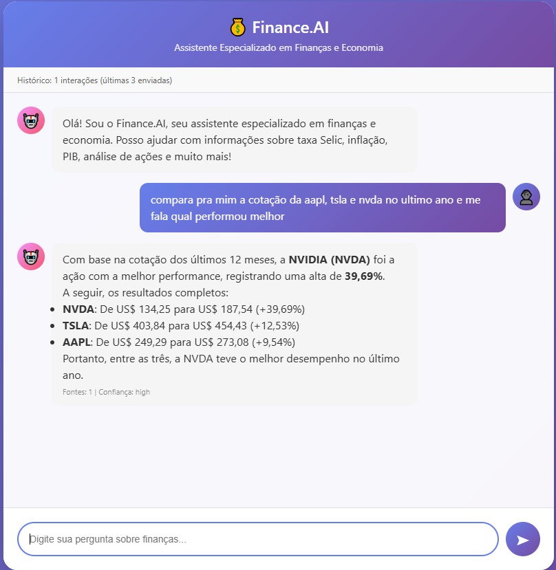

# Finance.AI - Dual Architecture Agent System

Finance.AI is a sophisticated RAG (Retrieval-Augmented Generation) system specialized in finance and economics. It now features **two distinct agent architectures**, allowing you to choose between deterministic control and autonomous reasoning.

## 🧠 Two Core Architectures

### 1. Finite State Machine (FSM) Agent
**Best for**: Production environments requiring strict control, predictability, and efficiency.
- **Deterministic**: Follows a predefined state flow (Route → Call Tool → Answer).
- **Prompt Engineering**: Uses text-based JSON structured prompts logic.
- **Endpoint**: `/strem_fsm`
- **Implementation**: `finitestatemachineAgent` package.

### 2. Hierarchical FSM (HSM) Agent [NEW] ⚡
**Best for**: High-performance streaming and native API integration.
- **Native Tool Calling**: Uses the LLM's native `tool_calls` API instead of text parsing.
- **Streaming & Telemetry**: Real-time token usage tracking (`In/Out`) and streaming.
- **Hierarchical**: Decomposed into superstates (`Reasoning`, `Execution`, `Recovery`, `Terminal`) and substates (`Router`, `Tool`, `Validation`, `Answer`).
- **Endpoint**: `/stream` (Default for Frontend Demo)
- **Implementation**: `finitestatemachineAgent/hfsm_agent.py`.

### 3. ReAct Agent (Reasoning + Acting)
**Best for**: Complex research, multi-step reasoning, and exploratory tasks.
- **Autonomous**: The LLM decides the next step based on observations.
- **Flexible**: Can refine queries, switch strategies, and self-correct dynamically.
- **Deep Reasoning**: Performs an explicit analysis step after each action.
- **Endpoint**: `/stream_react`
- **Implementation**: `ReactAgent` package.

---

## 🎯 Features

- **Triple Architecture**: Choose between FSM, HSM, or ReAct.
- **Telemetry**: Real-time token usage display in chat interface.
- **RAG Integration**: Specialized implementations for all architectures.
- **Financial Tools**: Semantic search, real-time stock prices (Yahoo Finance), and comparison.
- **Local PDF Processing**: Endpoint to process PDFs locally using **Docling**.
- **Decoupled Architecture**: Clean separation between core logic (`core/`), specific agents (`agents/`), and tools (`tools/`).

## 🏗️ Architectures Compared

### HSM Architecture (Hierarchical)
```mermaid
stateDiagram-v2
    [*] --> ReasoningState
    
    state ReasoningState {
        [*] --> RouterState
        RouterState --> ExecutionState : Needs Info
        RouterState --> TerminalState : Has Answer
    }

    state ExecutionState {
        [*] --> ToolState
        ToolState --> ValidationState
        ValidationState --> [*] : Valid
        ValidationState --> RecoveryState : Invalid
    }

    state RecoveryState {
        [*] --> RetryState
        RetryState --> ReasoningState : Retry
        RetryState --> TerminalState : Give Up
    }

    state TerminalState {
        AnswerState --> [*]
        FailState --> [*]
    }
```

### ReAct Architecture (LLM is Autonomous)
```
┌──────────────────────────────────────────────┐
│          Step-by-Step Reasoning Loop         │
│  ┌────────────────────────────────────────┐  │
│  │ 1. 🤔 Thought (Analyze Context)        │  │
│  │ 2. 🛠️ Action (Select Tool & Args)     │  │
│  │ 3. 📉 Observation (Tool Output)        │  │
│  └───────────────────┬────────────────────┘  │
│                      │                       │
│            ┌─────────┴──────────┐            │
│            ▼                    ▼            │
│      [Need Info?]         [Have Answer?]     │
│            │                    │            │
│      (Repeat Loop)        (Final Answer)     │
└──────────────────────────────────────────────┘
```

## 🚀 Installation

### 1. Clone the repository
```bash
git clone https://github.com/fredstrey/react_agent.git
```

### 2. Create virtual environment
```bash
python -m venv venv
source venv/bin/activate  # Linux/Mac
# or
venv\Scripts\activate  # Windows
```

### 3. Install dependencies
```bash
pip install -r requirements.txt
```

### 4. Configure environment variables
Create `.env` file:
```env
OPENROUTER_API_KEY=your_key_here
```

### 5. Start Qdrant (Docker)
```bash
docker run -p 6333:6333 qdrant/qdrant
```

## 📦 Project Structure

```
Finance.AI/
├── core/                      # SHARED COMPONENTS
│   ├── context.py             # Execution Context
│   ├── registry.py            # Tool Registry
│   ├── executor.py            # Tool Executor
│   └── schemas.py             # Data Schemas
├── finitestatemachineAgent/   # FSM ARCHITECTURE
│   ├── fsm_agent.py           # State Logic
│   └── ...
├── ReactAgent/                # REACT ARCHITECTURE
│   ├── agent.py               # Autonomous Logic
│   └── ...
├── agents/                    # AGENT IMPLEMENTATIONS
│   ├── rag_agent_fsm.py       # Finance Agent (FSM Version)
│   ├── rag_agent_v3.py        # Finance Agent (ReAct Version)
│   └── ...
├── tools/
│   ├── rag_tools_v3.py        # Financial Tools (@tool decorated)
│   └── ...
├── api/
│   └── api.py                 # FastAPI Interface
└── examples/
    └── rag_example.py         # Main Demo
```

## 🛠️ Available Tools

### 1. `search_documents`
Semantic search in financial documents
```python
search_documents(query="What is the Selic rate?")
```

### 2. `get_stock_price`
Get price of ONE stock
```python
get_stock_price(ticker="AAPL")
```

### 3. `compare_stocks`
Compare MULTIPLE stocks
```python
compare_stocks(tickers=["AAPL", "MSFT", "GOOGL"])
```

### 4. `redirect`
Indicates that question is out of scope

## 🎮 Usage

### Start API
```bash
python api/api.py
```

### Make request (Choose your Architecture)

#### 1. HFSM Agent (Default - Native Streaming)
```bash
curl -X POST http://localhost:8000/stream ...
```

#### 2. FSM Agent (Legacy)
```bash
curl -X POST http://localhost:8000/strem_fsm ...
```

#### 3. ReAct Agent (Autonomous)
```bash
curl -X POST http://localhost:8000/stream_react ...
```

**Or try the dubious vibecoded html frontend :D**
> ℹ️ **Note**: The frontend (`chat.html`) is configured to use the **`/stream` (HFSM Agent)** endpoint by default for the best streaming experience.




### Process PDF (Locally with Docling)
```bash
curl -X POST http://localhost:8000/process_pdf \
  -H "Content-Type: application/json" \
  -d '{"pdf_path": "C:/path/to/doc.pdf", "max_tokens": 500}'
```

## ⚙️ Configuration

### Switching Models
Configured in `agents/rag_agent_fsm.py` or `rag_agent_v3.py`:
```python
# FSM Agent
RAGAgentFSM(
    model="xiaomi/mimo-v2-flash:free",
    max_steps=10
)

# ReAct Agent
RAGAgentV3(
    model="xiaomi/mimo-v2-flash:free",
    max_iterations=3
)
```

## 📊 Implemented Features

✅ **Dual Architecture Core** (FSM + ReAct)  
✅ **Deterministic State Flow** (FSM)  
✅ **Autonomous Reasoning Loop** (ReAct)  
✅ Sequential tool execution  
✅ Multi-part query detection  
✅ Context accumulation  
✅ Intelligent response synthesis  
✅ Domain validation (finance/economics)  

## 🐛 Troubleshooting

### Qdrant won't connect
```bash
docker run -p 6333:6333 qdrant/qdrant
```

### Invalid API Key
Check `.env` file and configure `OPENROUTER_API_KEY`
