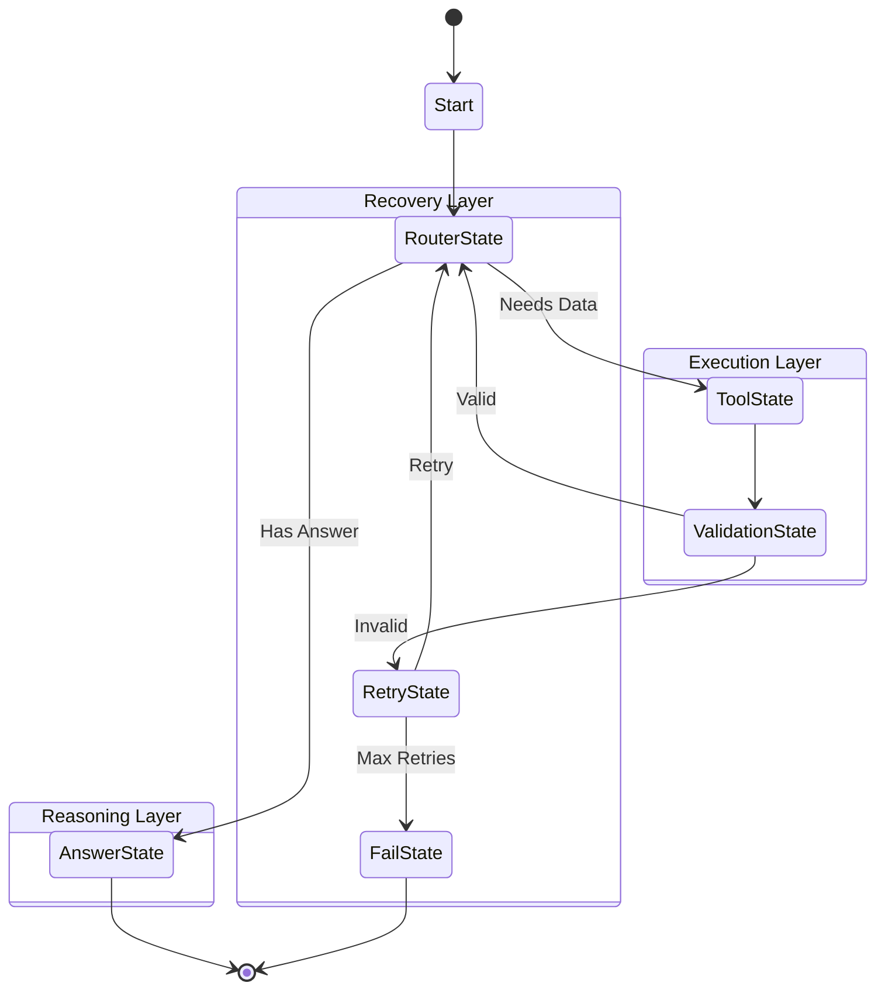

# Finance.AI - Production-Grade HFSM Agent Framework

Finance.AI is a sophisticated financial assistant powered by a **Hierarchical Finite State Machine (HFSM)** architecture. Built for production use with enterprise-grade features: context pruning, validation, retry logic, persistence, and comprehensive observability.

## 🏗️ Architecture Overview

### Hierarchical FSM (HFSM) Engine

The core of Finance.AI is a **hierarchical state machine** that provides deterministic, controllable, and observable execution flow:



### Key Features

- ✅ **Hierarchical States**: Organized into superstates (Reasoning, Execution, Recovery, Terminal)
- ✅ **Context Pruning**: Automatic token management to stay within LLM limits
- ✅ **Validation Layer**: Ensures tool outputs are valid before proceeding
- ✅ **Retry Logic**: Automatic recovery from failed tool calls
- ✅ **Persistence**: Snapshots saved at every state transition
- ✅ **Observability**: Comprehensive logging, metrics, and telemetry
- ✅ **Streaming**: Real-time token streaming with usage tracking
- ✅ **Extensible**: Easy to add custom states and tools

---

## 🚀 Quick Start

### 1. Installation

```bash
# Clone repository
git clone https://github.com/fredstrey/react_agent.git
cd Finance.AI

# Create virtual environment
python -m venv venv
source venv/bin/activate  # Linux/Mac
# or
venv\Scripts\activate  # Windows

# Install dependencies
pip install -r requirements.txt
```

### 2. Configuration

Create a `.env` file:
```env
OPENROUTER_API_KEY=your_key_here
```

### 3. Start Services

```bash
# Start Qdrant (vector database)
docker-compose up -d

# Or manually:
docker run -p 6333:6333 qdrant/qdrant
```

### 4. Run the API

```bash
python api/api.py
```

The API will be available at `http://localhost:8000`

### 5. Try the Frontend

Open `frontend/chat.html` in your browser for a beautiful chat interface with:
- Real-time streaming responses
- Token usage display (Input/Output)
- Source tracking
- Confidence indicators

---

## 📦 Project Structure

```
Finance.AI/
├── core/                          # Framework Core
│   ├── context.py                 # Execution Context & Memory
│   ├── registry.py                # Tool Registry
│   ├── executor.py                # Tool Executor
│   ├── decorators.py              # @tool decorator
│   └── schemas.py                 # Data Models
│
├── finitestatemachineAgent/       # HFSM Engine
│   └── hfsm_agent.py              # State Machine Implementation
│
├── agents/                        # Domain-Specific Agents
│   └── rag_agent_hfsm.py          # Finance Agent (Production)
│
├── tools/                         # Domain Tools
│   ├── rag_tools.py               # Financial Tools (search, stocks)
│   └── rag_schemas.py             # Tool Schemas
│
├── providers/                     # LLM Providers
│   ├── llm_client.py              # Unified LLM Client
│   ├── openrouter.py              # OpenRouter Provider
│   └── openrouter_function_caller.py
│
├── embedding_manager/             # RAG Components
│   └── embedding_manager.py       # Qdrant Integration
│
├── api/                           # FastAPI Server
│   ├── api.py                     # Main API
│   └── api_schemas.py             # Request/Response Models
│
├── frontend/                      # Web Interface
│   └── chat.html                  # Chat UI
│
├── examples/                      # Learning Examples
│   ├── README.md                  # Tutorial
│   ├── customer_support_agent.py  # Complete Agent Example
│   └── demo_custom_agent.py       # Custom States Example
│
├── logs/                          # Execution Logs
│   └── snapshots/                 # State Snapshots (JSON)
│
├── docs/                          # Technical Documentation
│   ├── technical_report_fsm_agent.md
│   └── technical_report_react_agent.md
│
└── docker-compose.yml             # Container Orchestration
```

---

## 🛠️ Available Tools

### Financial Tools

#### 1. `search_documents`
Semantic search in financial knowledge base (Qdrant)
```python
search_documents(query="What are the responsibilities of COPOM?")
# Returns: Top-3 relevant document chunks with scores
```

#### 2. `get_stock_price`
Get real-time price for a **single** stock
```python
get_stock_price(ticker="AAPL", period="1mo")
# Returns: Current price, change %, high/low, market cap
```

#### 3. `compare_stocks`
Compare performance of **multiple** stocks
```python
compare_stocks(tickers=["NVDA", "TSLA", "MSFT"], period="1y")
# Returns: Ranked performance, best/worst performers
```

#### 4. `redirect`
Indicates question is out of financial scope
```python
redirect(reason="Question about sports, not finance")
```

---

## 🎮 Usage Examples

### API Endpoints

#### Stream Chat (Main Endpoint)
```bash
curl -X POST http://localhost:8000/stream \
  -H "Content-Type: application/json" \
  -d '{
    "message": "Compare NVDA and TSLA performance over 1 year",
    "chat_history": []
  }'
```

#### Process PDF
```bash
curl -X POST http://localhost:8000/process_pdf \
  -H "Content-Type: application/json" \
  -d '{
    "pdf_path": "/path/to/document.pdf",
    "max_tokens": 500
  }'
```

### Python SDK

```python
from agents.rag_agent_hfsm import RAGAgentFSMStreaming
from embedding_manager.embedding_manager import EmbeddingManager

# Initialize
embedding_manager = EmbeddingManager()
agent = RAGAgentFSMStreaming(
    embedding_manager=embedding_manager,
    model="xiaomi/mimo-v2-flash:free"
)

# Run query
token_stream, context = agent.run_stream(
    query="What's the current price of NVDA?",
    chat_history=[]
)

# Stream response
for token in token_stream:
    print(token, end="", flush=True)

# Access metadata
print(f"\nSources: {context.get_memory('sources_used')}")
print(f"Confidence: {context.get_memory('confidence')}")
```

---

## 🧪 Learning Examples

The `examples/` directory contains complete, runnable examples:

### 1. Customer Support Agent
**File**: `examples/customer_support_agent.py`

A complete agent implementation showing:
- How to define domain-specific tools
- How to wrap `AgentEngine` in a custom class
- Production-ready pattern (like `rag_agent_hfsm.py`)

```bash
python examples/customer_support_agent.py
```

### 2. Travel Agent with Custom States
**File**: `examples/demo_custom_agent.py`

Advanced example demonstrating:
- How to create custom states (`VisaCheckState`)
- How to modify the execution flow
- When to use custom states vs just tools

```bash
python examples/demo_custom_agent.py
```

See `examples/README.md` for detailed tutorials.

---

## 🐳 Docker Deployment

### Using Docker Compose

```bash
# Build and start all services
docker-compose up --build

# Services:
# - hfsm_agent: Main API (port 8000)
# - hfsm_agent_qdrant: Vector DB (port 6333)
```

### Manual Docker

```bash
# Build image
docker build -t finance-ai .

# Run container
docker run -p 8000:8000 \
  -e OPENROUTER_API_KEY=your_key \
  finance-ai
```

---

## ⚙️ Configuration

### Model Selection

Edit `agents/rag_agent_hfsm.py`:
```python
RAGAgentFSMStreaming(
    embedding_manager=embedding_manager,
    model="xiaomi/mimo-v2-flash:free"  # Change model here
)
```

Supported models (via OpenRouter):
- `xiaomi/mimo-v2-flash:free` (Default, fast)
- `google/gemini-2.0-flash-exp:free`
- `anthropic/claude-3.5-sonnet`
- Any OpenRouter-compatible model

### Context Pruning

Adjust in `finitestatemachineAgent/hfsm_agent.py`:
```python
class ContextPruner:
    def __init__(self, strategy="cut_last_n", keep_recent=4):
        # keep_recent: Number of recent tool calls to keep full results
```

---

## 📊 Observability

### Logs

All execution logs are saved to `logs/`:
- `agent.log`: Main application log
- `snapshots/`: JSON snapshots at every state transition

### Metrics

Available in `context.metrics`:
- `state_visits`: Count of visits per state
- `prompt_tokens`: Input tokens used
- `completion_tokens`: Output tokens generated
- `total_tokens`: Total token usage

### Snapshots

Every state transition saves a snapshot:
```json
{
  "user_query": "...",
  "tool_calls": [...],
  "current_iteration": 2,
  "metrics": {...},
  "memory": {...}
}
```

---

## 🔧 Extending the Framework

### Adding New Tools

1. Create tool function with `@tool` decorator:
```python
from core.decorators import tool

@tool(
    name="my_custom_tool",
    description="What this tool does"
)
def my_custom_tool(arg1: str, arg2: int) -> Dict[str, Any]:
    # Implementation
    return {"success": True, "data": ...}
```

2. Register in your agent:
```python
registry.register(
    name=my_custom_tool._tool_name,
    description=my_custom_tool._tool_description,
    function=my_custom_tool,
    args_model=my_custom_tool._args_model
)
```

### Adding Custom States

See `examples/demo_custom_agent.py` for a complete example.

---

## 🐛 Troubleshooting

### Qdrant Connection Failed
```bash
# Ensure Qdrant is running
docker ps | grep qdrant

# Restart if needed
docker-compose restart hfsm_agent_qdrant
```

### Import Errors in Examples
Examples use `sys.path.insert` to find modules. Run from project root:
```bash
python examples/customer_support_agent.py
```

### API Key Invalid
Check `.env` file exists and contains valid key:
```bash
cat .env
# Should show: OPENROUTER_API_KEY=sk-or-v1-...
```

---

## 📚 Documentation

- **Architecture Deep Dive**: `docs/technical_report_fsm_agent.md`
- **Examples Tutorial**: `examples/README.md`
- **API Reference**: See docstrings in `api/api.py`

---

## 🤝 Contributing

This is a learning/research project. Feel free to fork and experiment!

---

## 📄 License

MIT License - See LICENSE file for details.
