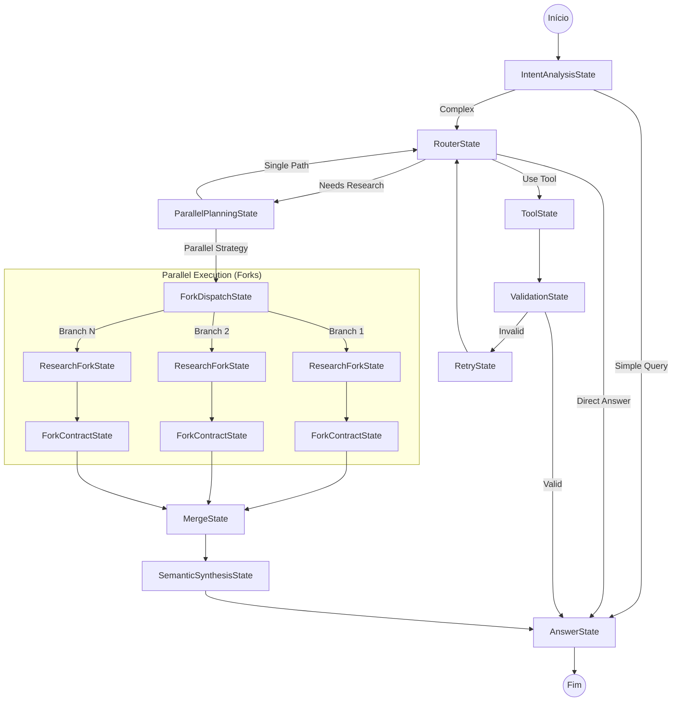

# Arquitetura da Máquina de Estados (HFSM Async Engine)

Este documento detalha todos os estados disponíveis na `AsyncAgentEngine`, suas responsabilidades e como interagem entre si.

## 🗺️ Visão Geral do Fluxo

---

## 📚 Catálogo de Estados

### 1. Estados de Entrada e Análise

#### `IntentAnalysisState`
*   **Função**: Analisa a query do usuário antes de qualquer decisão.
*   **Responsabilidade**:
    *   Identificar complexidade (`simple` vs `complex`).
    *   Identificar necessidade de tools (`needs_tools`).
    *   Gerar **Todo List** estruturado.
    *   Detectar **Idioma do Usuário** (`user_language`).
*   **Transições**:
    *   -> `AnswerState`: Se for query simples (Fast-Track).
    *   -> `RouterState`: Fluxo normal.

#### `ContextPolicyState`
*   **Função**: Guardião global de políticas (Safety).
*   **Responsabilidade**: Verificar limites de tokens, número máximo de requests globais (Safety Monitor).
*   **Transições**: Intercepta transições. Se safety violado -> `TerminalState` ou lança erro.

---

### 2. Estados de Decisão

#### `RouterState`
*   **Função**: O "cérebro" central.
*   **Responsabilidade**: Decidir o próximo passo com base no histórico e ferramentas disponíveis.
*   **Logica Otimizada**:
    *   Prioriza `IntentAnalysis` se ativado.
    *   Tratativa robusta para quando `IntentAnalysis` está desativado (evita loops e crashes).
*   **Transições**:
    *   -> `ToolState`: Executar ferramenta.
    *   -> `ParallelPlanningState`: Se `enable_parallel_planning=True` e detectar necessidade de pesquisa profunda.
    *   -> `AnswerState`: Se tiver informações suficientes.

#### `ParallelPlanningState`
*   **Função**: Arquiteto da execução paralela.
*   **Responsabilidade**: Analisar a query e propor uma estratégia de divisão em "Forks" (Ramos).
*   **Transições**:
    *   -> `ForkDispatchState`: Se estratégia for "parallel_research".
    *   -> `RouterState`: Se estratégia for "single" (execução linear).

---

### 3. Estados de Execução (Single Thread)

#### `ToolState`
*   **Função**: Executor de ferramentas.
*   **Responsabilidade**: Chamar `AsyncToolExecutor` para rodar a função Python real.
*   **Transições**:
    *   -> `ValidationState`: Se `skip_validation=False`.
    *   -> `AnswerState`: Se validação desligada (confiança cega).

#### `ValidationState`
*   **Função**: Auditor de qualidade.
*   **Responsabilidade**: Verificar se o resultado da Tool responde à pergunta (via função Python custom ou LLM).
*   **Transições**:
    *   -> `AnswerState` / `ForkContractState`: Se Válido.
    *   -> `RetryState`: Se Inválido.

#### `RetryState`
*   **Função**: Gestão de erro e retentativa.
*   **Responsabilidade**: Incrementar contadores de erro, adicionar dicas de correção ao contexto.
*   **Transições**:
    *   -> `RouterState`: Tentar de novo.
    *   -> `FailState`: Se estourar limite de tentativas.

---

### 4. Estados de Execução Paralela (Forks)

#### `ForkDispatchState`
*   **Função**: Gerenciador de Processos.
*   **Responsabilidade**: Criar cópias isoladas da Engine (Forks) para cada branch do plano e iniciá-las em paralelo (`asyncio.gather`).
*   **Transições**:
    *   -> `MergeState`: Quando todos os forks terminarem.

#### `ResearchForkState`
*   **Função**: "Mini-Agente" Especialista.
*   **Responsabilidade**: Substitui o Router dentro de um Fork. Foca apenas no objetivo específico do branch (ex: "Pesquisar Preço Petroleo").
*   **Transições**:
    *   -> `ToolState`: Executar tools (dentro do fork).
    *   -> `ForkContractState`: Quando terminar a pesquisa.

#### `ForkContractState`
*   **Função**: Redator de Relatório.
*   **Responsabilidade**: Sintetizar o que foi descoberto no Fork em um formato estruturado (Contrato) para o Merge.
*   **Transições**:
    *   -> `TerminalState` (Do Fork): Encerra o sub-processo.

---

### 5. Consolidação e Resposta

#### `MergeState`
*   **Função**: Agregador passivo.
*   **Responsabilidade**: Receber os outputs de todos os forks e juntá-los numa lista ou dicionário.
*   **Transições**:
    *   -> `SemanticSynthesisState`: Passar dados brutos para síntese.

#### `SemanticSynthesisState`
*   **Função**: Redator Final (Integrador).
*   **Responsabilidade**: Pegar os dados fragmentados dos forks e escrever uma resposta coesa e fluida.
*   **Features Avançadas**:
    *   Recebe `user_language` e `todo_list` como constraints.
    *   Gera métricas de confiança e gaps.
*   **Transições**:
    *   -> `AnswerState`: Entregar o texto final (Synthesis Result).

#### `AnswerState`
*   **Função**: Comunicador Final.
*   **Responsabilidade**: Gerar a resposta final para o usuário (em Stream ou Bloco).
*   **Flow Duplo (Dual Mode)**:
    1.  **Synthesis Mode (Prioritário)**: Usa o texto já sintetizado pelo `SemanticSynthesisState`. Limpo e direto.
    2.  **Fallback Mode**: Usa histórico + tool outputs brutos se a síntese falhar.
*   **Enforcement**:
    *   Garante resposta no idioma do usuário (`user_language`).
    *   Exige resposta "FINAL" e "COMPRREHENSIVE" no fallback (sem enrolação/conversacional).
    *   Verifica checklist do `todo_list`.
*   **Transições**:
    *   -> `TerminalState`: Fim da conversa.

---

## 🎣 Hooks e Customizações

A Engine permite interceptar o fluxo em pontos chave:

1.  **`post_router_hook(context, transition)`**:
    *   Chamado após `RouterState` decidir.
    *   Use para forçar regras de negócio (ex: "Sempre use tools para finanças").
    *   Retorne nova `Transition` ou `None`.

2.  **`validation_fn(context, tool, result)`**:
    *   Chamado dentro de `ValidationState`.
    *   Substitui a validação via LLM por código Python rápido.

3.  **`transition_overrides`**:
    *   Lista de regras globais injetadas na Engine.
    *   Ex: "Se Estado == X e Condição Y, vá para Z".

## 🔮 Estados Futuros / Placeholders

*   **`ResponseValidatorState`**: Planejado para validar a resposta final antes do stream (Guardrails).
*   **`HumanFeedbackState`**: Planejado para pausar execução e aguardar aprovação humana ("Human-in-the-Loop").
*   **`ClarificationState`**: Planejado para lidar com queries ambíguas, solicitando informações adicionais ao usuário (configurável via `enable_clarification`).

## 🔌 Pluggable Strategies (New)

The architecture supports pluggable strategies for key components using the Strategy Pattern. This allows developers to choose between complex/structured behaviors and simple/text-based behaviors.

### Fork Contract Strategy
Controlled via `contract_strategy` parameter in `Agent` or `AsyncAgentEngine`.
- **Epistemic (`epistemic`)**: (Default) Extracts structured claims with evidence, confidence scores, and uncertainty tracking (JSON-based). Best for rigorous research.
- **Simple Text (`simple`)**: Generates a plain text summary of research findings. Best for summarization tasks.

### Synthesis Strategy
Controlled via `synthesis_strategy` parameter in `Agent` or `AsyncAgentEngine`.
- **LLM Synthesis (`llm`)**: (Default) Uses an LLM to weave disparate findings into a single, coherent narrative using semantic reasoning.
- **Concatenation (`concat`)**: Simply appends the findings from all forks sequentially (e.g., "Result 1: ... Result 2: ..."). Best when distinct outputs are needed.
