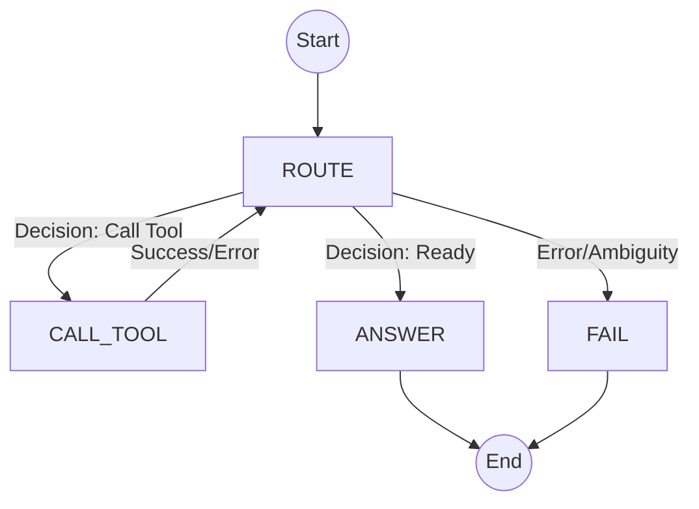

# Technical Report: FSM (Finite State Machine) Agent Architecture

**Author:** Frederico Strey  
**Date:** December 2025  
**Version:** 1.0

## 1. Executive Summary

This report details the architecture and implementation of the **Finite State Machine (FSM) Agent** developed for the Finance.AI platform. Unlike flexible but unpredictable "ReAct" loops, the FSM Agent imposes a strict, deterministic state flow. This architecture is designed to maximize reliability, reduce token consumption, and eliminate "loops of death" common in autonomous agents when facing ambiguous tools or errors.

## 2. Core Concept: Determinism vs. Autonomy

The key architectural decision was to move from a purely probabilistic flow (where the LLM decides *everything* implicitly) to a stated-based flow (where the LLM decides *transitions* within a rigid structure).

### ReAct (Reasoning + Acting)
- **Flow**: Observe → Thought → Action → Observation (Loop).
- **Pros**: Highly flexible, can solve novel problems.
- **Cons**: Can get stuck in loops, hallucinate tool names, or fail to stop when ready.

### FSM (Finite State Machine)
- **Flow**: Explicit States (`ROUTE` → `CALL_TOOL` → `ROUTE` → `ANSWER`).
- **Pros**: Predictable, easier to debug, enforcing strict schemas.
- **Cons**: Less "creative" in problem-solving steps.

## 3. Architecture Overview

 The agent is implemented in `StateMachineAgent` (`FiniteStateMachineAgent/fsm_agent.py`) and operates on four distinct states:

| State | Description |
| :--- | :--- |
| **ROUTE** | The "Brain". Analyzes the query and history to decide the single next logical step. |
| **CALL_TOOL** | The "Hands". Executes the chosen tool securely and captures the output. |
| **ANSWER** | The "Voice". Synthesizes the final answer using collected context. |
| **FAIL** | Error handling state (max steps reached or internal error). |

### 3.1 State Flow Diagram



## 4. Implementation Details

### 4.1 The Decision Engine (`_decide`)

The core innovation is the `_decide` method. Instead of asking the LLM to "do something", we force it to output a specific JSON structure corresponding to a `Decision` Pydantic model:

```json
{
  "call_tool": true,
  "tool_name": "get_stock_price",
  "arguments": { "ticker": "AAPL" },
  "ready_to_answer": false
}
```

**Key Prompting Features:**
1.  **Full JSON Schema Injection**: The prompt includes the *exact* JSON schema for every tool's arguments. This drastically reduces `ValidationError`s.
2.  **Explicit Context**: The `_tool_context` method injects a structured history of previous calls and results, allowing the model to "see" what it has already done.
3.  **Strict Boolean Logic**: The model must explicitly set `ready_to_answer: true` to exit the loop.

### 4.2 The Execution Loop (`run`)

The `run` method implements the `while` loop that drives the machine:

```python
while state not in {AgentState.ANSWER, AgentState.FAIL}:
    if state == AgentState.ROUTE:
        decision = self._decide(...)
        # Transition logic...
    elif state == AgentState.CALL_TOOL:
        result = self.executor.execute(...)
        # Context update...
        state = AgentState.ROUTE
```

This loop is bounded by `max_steps` (default: 10) to prevent infinite billing cycles.

### 4.3 Integration with Core Components

The FSM Agent leverages the shared `core` module for robust plumbing:
-   **`ToolRegistry`**: Singleton that managing tool definitions.
-   **`ToolExecutor`**: Handles the actual function execution and exception management.
-   **`ExecutionContext`**: A unified state object that tracks user query, chat history, and the list of tool calls/results.

## 5. Performance Benefits

1.  **Token Efficiency**: By separating "Reasoning" (Route) from "Answering" (Answer), we avoid carrying the entire conversation history into every single tool call prompt in some configurations, or at least structure it more cleanly.
2.  **Reliability**: The strict JSON enforcement for decisions means the agent rarely outputs malformed tool calls.
3.  **Debuggability**: Every step is a discrete state transition. If the agent fails, we know exactly if it was a bad Routing decision or a Tool Execution error.

## 6. Conclusion

The FSM Agent represents a mature step in our agentic architecture. By trading unbounded flexibility for structured determinism, we have created a highly reliable engine for the Finance.AI platform, capable of handling complex RAG tasks with consistent success rates.
