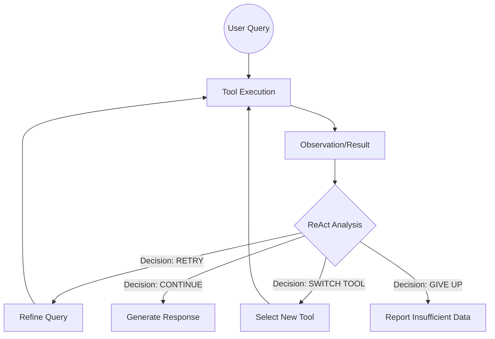

# Technical Report: ReAct (Reasoning + Acting) Agent Architecture

**Author:** Frederico Strey  
**Date:** December 2025  
**Version:** 1.0

## 1. Executive Summary

This report details the architecture of the **ReAct (Reasoning + Acting) Agent** implementation for the Finance.AI platform. While the FSM Agent offers deterministic control, the ReAct Agent is designed for **autonomous problem solving**. It implements a dynamic feedback loop where the agent not only executes tools but explicitly *reasons* about the results, allowing it to refine queries, correct mistakes, and handle complex, multi-step financial questions that traditional linear chains cannot solve.

## 2. Core Concept: The Reasoning Loop

The core philosophy of this implementation is that **executing a tool is not enough**. The agent must understand *what happened* after execution and decide the next move.

**The "ReACT" Cycle:**
1.  **Reason**: Analyze the user request and current context.
2.  **Act**: Choose a tool to execute (e.g., `get_stock_price`).
3.  **Observe**: Read the tool's output.
4.  **Reason (Again)**: Analyze if the output is sufficient. If not, why? (Empty result? Wrong tool? Partial answer?)
5.  **Refine**: Generate a new action or query based on the observation.

## 3. Architecture Overview

The ReAct implementation is centered around the `ReActAgent` class (`agents/react_agent.py`), which acts as the "Brain" or "Critic" inside the broader `ToolCallingAgent` loop.

### 3.1 The Decision Matrix (`ReActDecision`)

Unlike standard agents that blindly blindly consume tool outputs, our ReAct agent produces one of four explicit decisions after every step:

| Decision | Logic | Example Scenario |
| :--- | :--- | :--- |
| **CONTINUE** | Information is sufficient. Stop iterating and generate final answer. | "Price of AAPL found." |
| **RETRY_WITH_REFINEMENT** | Tool failed or gave poor results. Try again with a better query. | `search_docs("taxes")` -> 0 results -> Refine to `search_docs("Brazilian tax laws 2024")` |
| **CALL_DIFFERENT_TOOL** | The wrong tool was used, or multi-part query needs another tool. | User asked "AAPL price and Selic rate". `get_stock_price` ran. Now call `search_documents`. |
| **INSUFFICIENT_DATA** | Max iterations reached or data seemingly doesn't exist. | Stop and inform user of limitation. |

### 3.2 Logic Flow Diagram



## 4. Implementation Details

### 4.1 The `analyze_and_decide` Engine

The heart of the agent is the `analyze_and_decide` method. It constructs a rich prompt containing:
1.  **Original Query**: What the user actually wants.
2.  **Current Query**: What we just searched for.
3.  **Tool Results**: The raw JSON output from the tool.
4.  **Accumulated Context**: What we learned in *previous* steps (crucial for multi-part questions).

The LLM is then instructed to output a structured block:
```text
DECISION: RETRY_WITH_REFINEMENT
REASONING: The search for "Apple" returned stock data, but the user asked about the fruit.
REFINED_QUERY: nutritional value of apple fruit
CONFIDENCE: 0.95
```

### 4.2 Handling Multi-Part Queries

A unique feature of this architecture is its ability to handle compound questions like *"Compare AAPL price with the current Selic rate"*.
1.  **Iteration 1**: Agent calls `get_stock_price('AAPL')`.
2.  **Analysis**: See AAPL price. checks Original Query. Notices "Selic rate" is missing.
3.  **Decision**: `CALL_DIFFERENT_TOOL`.
4.  **Reasoning**: "We have stock price, now we need the Selic rate."
5.  **Iteration 2**: Agent calls `search_documents('Taxa Selic atual')`.
6.  **Analysis**: Both parts present in context.
7.  **Decision**: `CONTINUE`.

## 5. Performance vs. Cost

*   **Pros**:
    *   **High Success Rate**: Can recover from bad initial searches.
    *   **Complex Reasoning**: Solves problems simple RAG chains cannot.
    *   **Self-Correction**: detects empty results and tries synonyms automatically.
*   **Cons**:
    *   **Latency**: "Thinking" takes time. Each iteration adds an LLM call.
    *   **Cost**: Recursive analyzing consumes more tokens than linear execution.

## 6. Conclusion

The ReAct Agent provides the **autonomy** required for complex investigations. By explicitly modeling the "Critical Thought" process via `ReActDecision`, we transform the agent from a simple tool-user into a dynamic problem solver, capable of navigating ambiguous requests and delivering comprehensive answers.
